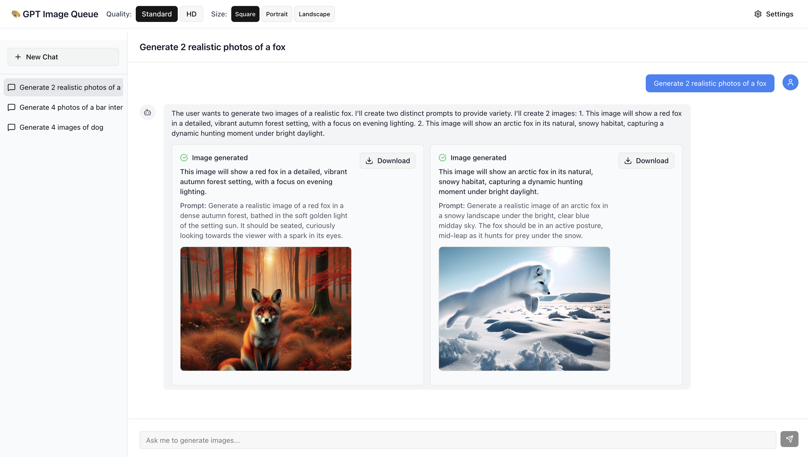

# GPT Image Queue

A web application for generating images using the ChatGPT API (DALL-E 3). Built with Next.js 15, TypeScript, Tailwind CSS, shadcn/ui, and MobX.



## 🚀 Live Demo

**[Try the app live on GitHub Pages](https://holiber.github.io/gpt-image-queue/)** (opens in new window)

## Features

- 🎨 **Image Generation**: Generate images using OpenAI's DALL-E 3 API
- 💬 **Chat Interface**: ChatGPT-like interface with conversation history
- 📋 **Task Queue**: Sequential processing of multiple image generation requests
- 💾 **Local Storage**: API key and chat history stored locally
- 📱 **Responsive Design**: Works on desktop and mobile devices
- ⬇️ **Download Images**: Download generated images with human-readable names

## Getting Started

### 🎯 Quick Start

**Want to try it immediately?** Visit the [live demo](https://holiber.github.io/gpt-image-queue/) (opens in new window) and add your OpenAI API key in settings!

### Prerequisites

- Node.js 18+ (recommended: latest stable version)
- OpenAI API key with DALL-E 3 access

### Installation

1. Clone the repository:
```bash
git clone <repository-url>
cd gpt-image-queue
```

2. Install dependencies:
```bash
npm install
```

3. Start the development server:
```bash
npm run dev
```

4. Open [http://localhost:3000](http://localhost:3000) in your browser

### Configuration

1. Click the "Settings" button in the sidebar
2. Enter your OpenAI API key
3. The key is stored locally and never shared

## Usage

### Generating Images

Simply type natural language requests in the chat:

- "Generate an image of a sunset over mountains"
- "Create a picture of a cute cat"
- "Draw a futuristic city"
- "Show me an image of a robot"

### Multiple Images

You can request multiple images in a single message:

- "Generate an image of a dog and another image of a cat"
- "Create pictures of a house, a car, and a tree"

### Task Management

- Images are generated sequentially (one at a time)
- Each task shows its status: pending, generating, completed, or failed
- Download completed images with descriptive filenames

## Technical Details

### Architecture

- **Frontend**: Next.js 15 with App Router
- **State Management**: MobX for reactive state management
- **Styling**: Tailwind CSS with shadcn/ui components
- **Icons**: Lucide React
- **API**: Direct integration with OpenAI DALL-E 3 API

### Key Components

- `ChatStore`: MobX store managing chats, messages, and image tasks
- `GPTImageService`: Service handling OpenAI API integration
- `MainLayout`: Main application layout with sidebar and chat area
- `ChatInterface`: Chat UI with message display and input
- `ImageTaskComponent`: Individual image task display and management
- `SettingsModal`: API key configuration modal

### Data Storage

- Chat history and settings stored in browser localStorage
- No server-side storage required
- All data remains on your device

## API Integration

The application connects directly to OpenAI's DALL-E 3 API from the frontend:

```typescript
// Example API call
const response = await fetch('https://api.openai.com/v1/images/generations', {
  method: 'POST',
  headers: {
    'Authorization': `Bearer ${apiKey}`,
    'Content-Type': 'application/json',
  },
  body: JSON.stringify({
    model: 'dall-e-3',
    prompt: prompt,
    n: 1,
    size: '1024x1024',
    quality: 'standard',
    response_format: 'url',
  }),
});
```

## Development

### Available Scripts

- `npm run dev`: Start development server
- `npm run build`: Build for production
- `npm run start`: Start production server
- `npm run lint`: Run ESLint

### Project Structure

```
src/
├── app/                 # Next.js app directory
├── components/          # React components
│   ├── ui/             # shadcn/ui components
│   ├── ChatInterface.tsx
│   ├── ChatSidebar.tsx
│   ├── ImageTaskComponent.tsx
│   ├── MainLayout.tsx
│   └── SettingsModal.tsx
├── services/           # API services
│   └── gptImageService.ts
├── stores/            # MobX stores
│   └── chatStore.ts
└── lib/               # Utilities
    └── utils.ts
```

## 🚀 Deployment

This project is automatically deployed to GitHub Pages using GitHub Actions. Every push to the main branch triggers a new deployment.

- **Live URL**: https://holiber.github.io/gpt-image-queue/
- **Deployment**: Automatic via GitHub Actions
- **Static Export**: Optimized for GitHub Pages hosting

## Contributing

1. Fork the repository
2. Create a feature branch
3. Make your changes
4. Test thoroughly
5. Submit a pull request

## License

MIT License - see LICENSE file for details

## Support

For issues and questions:
1. Check the GitHub issues page
2. Create a new issue with detailed description
3. Include steps to reproduce any bugs

---

Built with ❤️ using Next.js, TypeScript, and OpenAI's DALL-E 3 API.